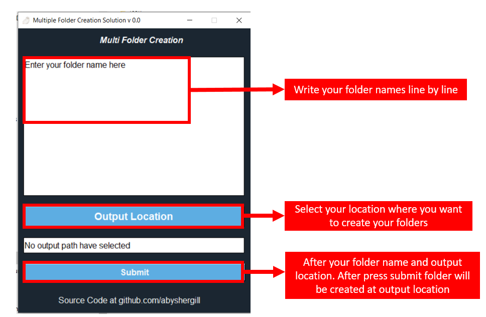

# Multiple Folder Creation Solution V 0.0  

## Introduction :
With this programe you can write make the multiple folder at once this work with windows machine.

## How to use 
1. In the root to folder click main.exe.

2. In the appeared window

   1. first **enter your folder name**
   2. **Select the output location** where you want to create the
   3. click the **submit** 

